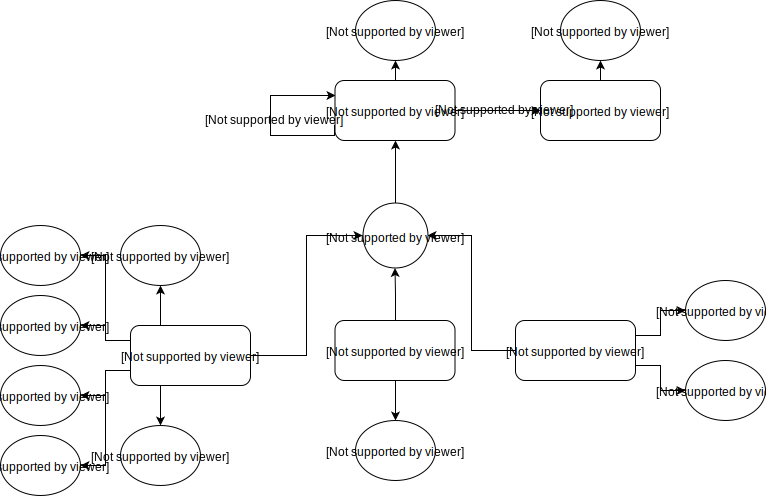
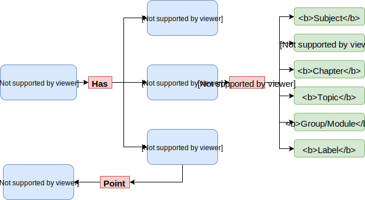
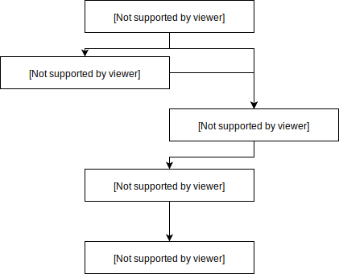

# law Clinic Server

#### What and How

* ##### Database 

  PostgreSQL

* ##### Server Side Framework

  Django

* ##### API

  * REST

    For form handling 

  * Graph-QL

    For dynamic query support


***

#### Schemas

* #####  Blog Models




* ##### Folder

  


* ##### Category Hierarchy 

  

***

#### Sample Queries

* Create 'Subject' category
```
mutation {
  createCategory(name:"Subject"){
    category{
      id
      uid
      name
    }
  }
}
```


* Create a 'Subject' folder 'Networking'; as ROOT distance=0
```
mutation {
  createFolder(categoryUid:10, name:"Networking", distance:0){
    folder{
      name
      distance
      category{
        name
      }
      selfLoc{
        uid
      }
      rootLoc{
        uid
      }
    }
  }
}
```


* Create a post agains a folder
```
mutation {
  createPost(folderLoc:9, title:"What is routing", body:"Routing Body"){
    post{
      uid
      title
      body
      dateTime
    }
  }
}
```


* Query all posts inside a folder
```
query{
  folder(selfLoc:9){
    name
    postSet{
      uid
      title
      body
      dateTime
    }
  }
}
```


* Update a post title
```
mutation{
  updatePost(uid:2, title:"What is dynamic routing?"){
    post{
      title
      body
      dateTime
    }
  }
}
```


* Create a CQ question
```
mutation{
  createCq(question:"What's the time?"){
    cq{
      uid
    }
  }
}
```


* Set a relation between a CQ and a Folder
```
mutation{
  createCqTag(cqUid:2, folderLoc:8){
    cqTag{
      uid
    }
  }
}
```


